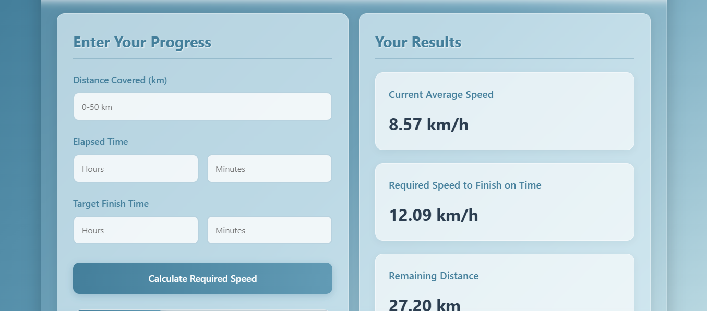
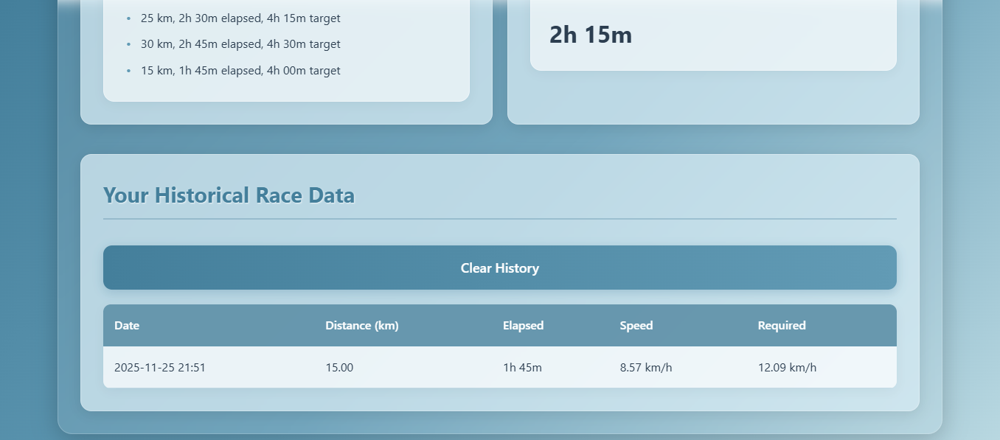

## 🏃‍♂️ Marathon Runner Progress Tracker

A lightweight PHP-based web application that helps marathon runners track their progress in real time, calculate their current speed, and determine the required speed needed to finish a marathon within a target time.

This tool also stores historical race calculations so athletes can monitor improvement over time.

---

## 📌 Features

✔️ **Real-Time Performance Calculation**
- Input covered distance
- Enter elapsed time
-Set your target finish time
* Instantly see:
 -Current average speed
 -Required speed to finish on time
 -Remaining distance
 -Remaining time

✔️ **Progress Visualization**
- Built-in progress bar showing how much of the 42.195 km marathon is completed.

✔️ **Automatic History Tracking**
- Every calculation is saved into a JSON file.
* History table displays:
  -Date & time
  -Covered distance
  -Elapsed time
  -Current speed
  -Required speed
-Includes Clear History button.

✔️ **Fully Frontend + PHP Backend**
- Zero database required
- Uses a simple race_history.json file
- Works on any PHP server

---

## 🛠️ Tech Stack

- PHP
- HTML5
- CSS3
- JavaScript
- JSON for local data storage

---

## 📂 Project Structure

``
/marathon_tracker
│── index.php               # Main application logic + UI
│── style.css               # Styling for the interface
│── race_history.json       # Auto-generated history storage (JSON)
│── README.md               # Project documentation
│
└── /storage                # Future storage directory (optional)
     └── marathon_data.txt  # Placeholder for extended data logging

``

---

## 🚀 Installation & Setup

**1. Download or Clone Repository**
- git clone https://github.com/Khalipha-Samela/Marathon-Tracker.git

**2. Move Project to PHP Server**
Place it in:
- XAMPP → htdocs
- WAMP → www
- Localhost environment
- Or upload to any PHP hosting platform

**3. Ensure Write Permissions**
- The application needs to write to race_history.json.
- If the file doesn’t exist, it will be created automatically.

**4. Access the App**
Visit:
- http://localhost/marathon-progress-tracker/

---

## 📸 Screenshots (Optional)

Add these once you push the project:

 <br>
 <br>


---

## 📐 How It Works

**Distance & Time Input**
You provide:
- Covered distance (km)
- Elapsed hours + minutes
- Target hours + minutes

The system calculates:
- Current speed → distance / time
- Required speed → remaining distance / remaining time

All calculations are validated to prevent errors (negative input, impossible times, etc.)

---

## 🧮 Formula Reference

**Current Speed**
```current_speed = covered_distance ÷ (elapsed_minutes / 60)```

**Required Speed**
``
remaining_distance = 42.195 - covered_distance
remaining_time = target_minutes - elapsed_minutes

required_speed = remaining_distance ÷ (remaining_time / 60)
``

---

## 🗂️ Race History

All results are automatically stored in:
``race_history.json``

You can clear the full history with a built-in button.

Example entry:
``
{
  "date": "2025-01-01 14:30",
  "covered_distance": 25,
  "elapsed_time": 150,
  "current_speed": 10,
  "required_speed": 12.2
}
``

---
## 🎨 UI Highlights
- Clean and responsive layout
- Easy input styling
- Dynamic progress bar
- Results formatted for readability
